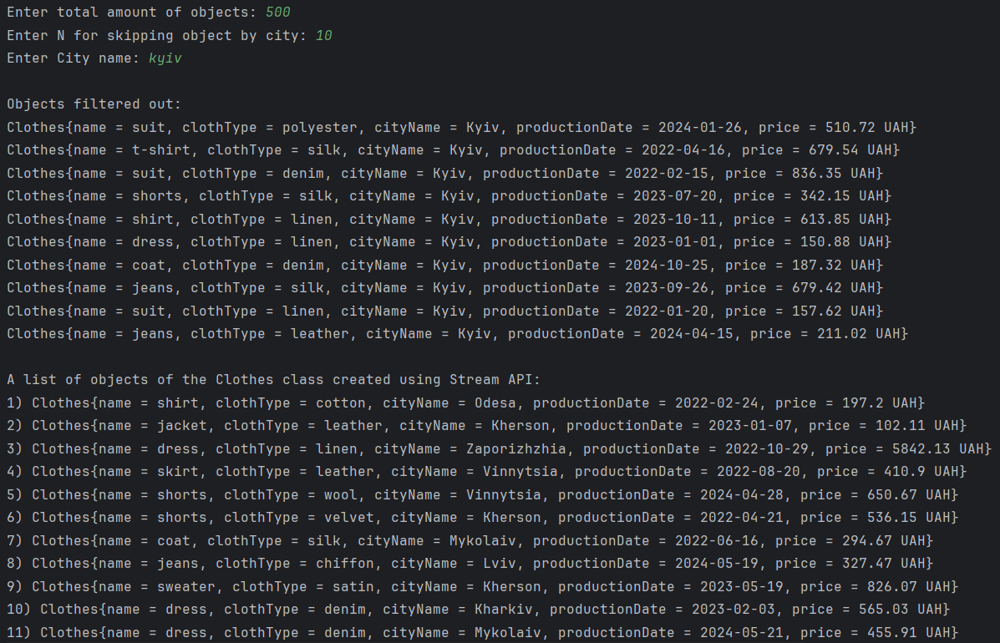
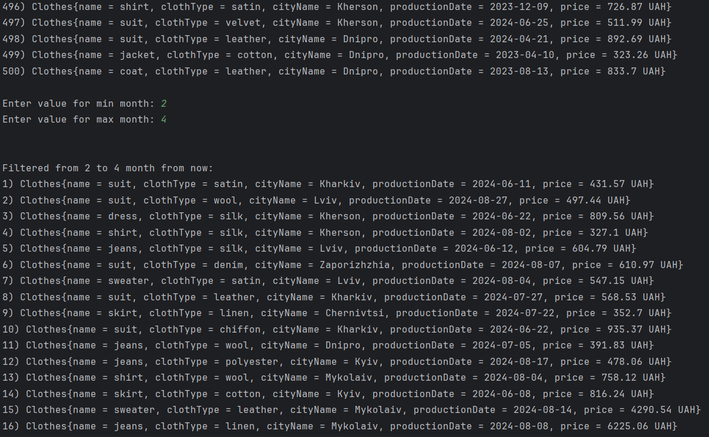
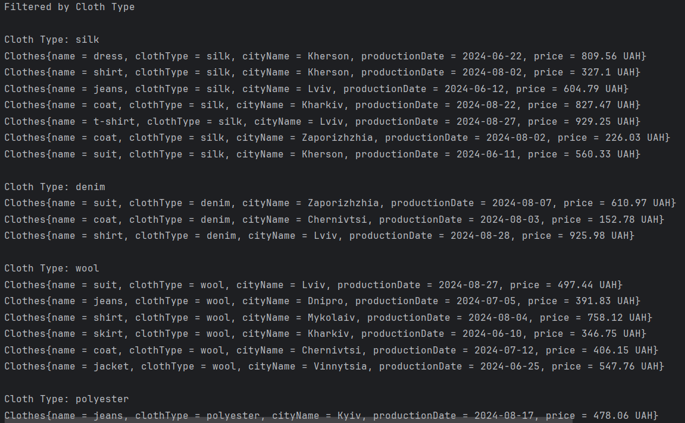
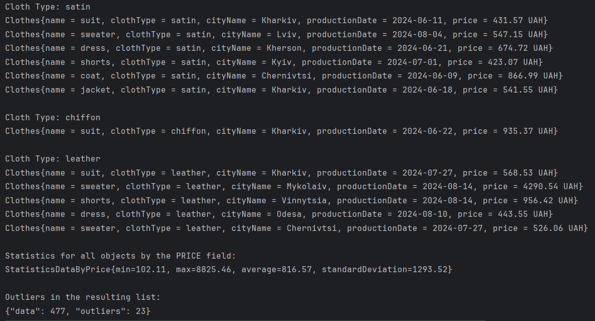

# Java_lab1_StreamAPI
**Автор:** Пекур Вікторія

**Група:** ІО-24

**Залікова книжка:** №2420

Варіант: 2420 % 4 = **0**

**Опис проекту:**
Цей проект призначений для генерації списку об'єктів класу Clothes, їх фільтрації, групування, аналізу статистики за цінами та визначення викидів (outliers). Використовуються колекції Java та API Stream для обробки даних. Користувач може задавати параметри для фільтрації об'єктів за містом, місяцями з моменту виробництва та типами одягу, а також отримувати статистичні дані про ціни.

**1) Збірка:** Проект не потребує додаткових інструментів для збірки, таких як Maven чи Gradle. Для запуску проекту достатньо мати встановлену Java (версія 8 або новіша).

**2) Кроки для запуску:**

1. Скачайте або скопіюйте проект на ваш комп'ютер.
2. Переконайтеся, що у вас встановлена Java на вашій системі.
3. Відкрийте командний рядок або термінал.
4. Перейдіть до каталогу, де знаходиться скомпільований проект.
5. Скомпілюйте код, використовуючи команду:
   javac -d bin src/main/java/org/example/*.java
6. Запустіть програму, використовуючи команду:
   java -cp bin org.example.Main
   
**3) Використання:**
Після запуску програма запросить ввести:

1. Загальну кількість об'єктів для створення.
2. Значення N для пропуску об'єктів за містом.
3. Назву міста для фільтрації.
4. Діапазон місяців для фільтрації за часом виробництва.
Програма виведе список об'єктів, відфільтрованих за місяцями, і по типу одягу, а також статистику по цінах, включаючи кількість викидів (outliers).

**Залежності:** Проект не має зовнішніх залежностей і використовує тільки стандартні бібліотеки Java.

**Скріншоти виконання:**

**Продовження попереднього списку та фільтрація цього списку в залежності від дати:

**Розбиття отриманого фільтрованого списку на групи за типом тканини:

**Продовження попереднього списку та вивід статистики згідно завданню:

